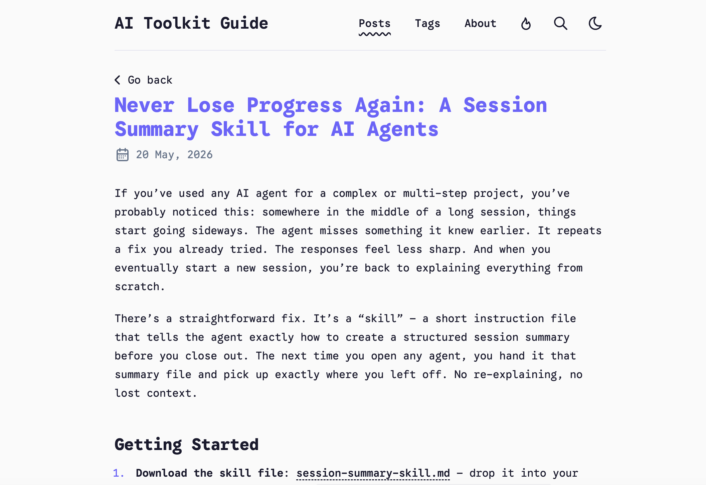

[English](README.md) | 中文

# AI Toolkit Guide

[ejuerz.com](https://ejuerz.com/) 的源码——给真人看的 AI 工具实用指南与真实对比，不是写给开发者的。

基于 [satnaing/astro-paper](https://github.com/satnaing/astro-paper)（AstroPaper v6）二次精简，专注一件事：稳定输出关于 AI agent 技能、CLI 工具、工作流的英文极简内容。

## ✨ 项目内容

- **3 篇英文文章**（持续更新中），主题：agent 技能、CLI 基础、多 agent 工作流
- **动态 OG 图**，每篇文章独立生成（Satori + Sharp）
- **静态搜索**（Pagefind）
- **深色/浅色模式**平滑切换
- **集成 AdSense**（仅英文文章区投广告；`/forbtbuer/` 学生共享区完全无广告）
- **i18n 已就绪**（当前只配 `en`）

## 📸 界面预览

**首页**


**精选文章**

| Agent Reach — 给 AI 接上眼睛 | Session Summary 技能 |
| --- | --- |
|  |  |
| 一个免费的网页平台，让任何 AI agent 都能免 API key 搜索和阅读 Twitter、Reddit、GitHub、arXiv、Hacker News、YouTube 等 12+ 数据源。 | 一个 SKILL.md 文件，把长 agent 会话的所有进度写入一个文件——新会话瞬间接力。兼容 Claude Code、Hermes、Cursor。 |

## 🛠 技术栈

| 层        | 工具                                                    |
| --------- | ------------------------------------------------------- |
| 框架      | [Astro 6](https://astro.build/)                         |
| 样式      | [Tailwind CSS 4](https://tailwindcss.com/)              |
| 类型检查  | TypeScript 6                                            |
| 代码高亮  | Shiki (min-light / night-owl)                           |
| 搜索      | [Pagefind](https://pagefind.app/)                       |
| OG 图     | [Satori](https://github.com/vercel/satori) + Sharp      |
| CI/CD     | GitHub Actions                                          |
| 托管      | Cloudflare Pages                                        |
| 变现      | Google AdSense (pub-7420993311388251)                   |

## 📁 目录结构

```
/
├── src/
│   ├── content/posts/      # 英文博客文章（实际发布内容）
│   ├── layouts/            # Layout.astro, PostLayout.astro
│   ├── components/         # Card, Header, Footer, Tag, 等
│   ├── pages/              # /, /posts, /tags, /search, /trending, /about
│   ├── i18n/               # en 翻译字符串
│   ├── utils/              # postFilter, getSortedPosts, withBase, ...
│   ├── config.ts           # 内部解析后的配置（不要直接改）
│   └── content.config.ts   # 集合定义：posts, btbuer, pages
├── astro-paper.config.ts   # 用户可编辑的站点配置
├── astro.config.ts         # Astro + 集成
├── public/                 # 静态资源、ads.txt、favicon
└── .github/workflows/      # deploy.yml, ci.yml
```

所有发布文章都放在 `src/content/posts/`。扔一个新的 `*.md` 进去，下次 build 就会出现在网站上。

## 🧞 本地运行

```bash
pnpm install
pnpm run dev        # http://localhost:4321
pnpm run build      # 类型检查 + 构建 + 跑 pagefind + 拷贝索引到 public/
pnpm run preview    # 本地预览生产构建
```

需要 Node ≥ 22.12。

或者用 Docker 跑：

```bash
docker compose up          # http://localhost:80
```

## ✍️ 写一篇新文章

在 `src/content/posts/your-slug.md` 创建文件：

```markdown
---
title: "标题"
description: "一句话简介，会显示在卡片和 OG 图上。"
pubDatetime: 2026-06-04
tags: ["ai-tools", "cli"]
featured: false
draft: false
---

## 开头

第一句话点出问题。

## 它能干嘛

直接讲——不写故事、不堆例子。

## 怎么用

真实步骤，能复制粘贴。
```

文件名（slug）就是 URL 的一部分。子目录也行，会拼到路径里。

## 🚀 部署

推到 `main` → GitHub Action 跑 `pnpm run build` → Cloudflare Pages 部署 `dist/`。

仓库 Settings 需要的 secrets：
- `CLOUDFLARE_API_TOKEN`
- `CLOUDFLARE_ACCOUNT_ID`
- `CF_PAGES_PROJECT_NAME`

## 📜 License

MIT — 基于 [satnaing/astro-paper](https://github.com/satnaing/astro-paper)（MIT）。

## 📬 联系

- 站点：[ejuerz.com](https://ejuerz.com/)
- X: [@ejuerz](https://x.com/ejuerz)
- 邮箱：ejuer_z@163.com
